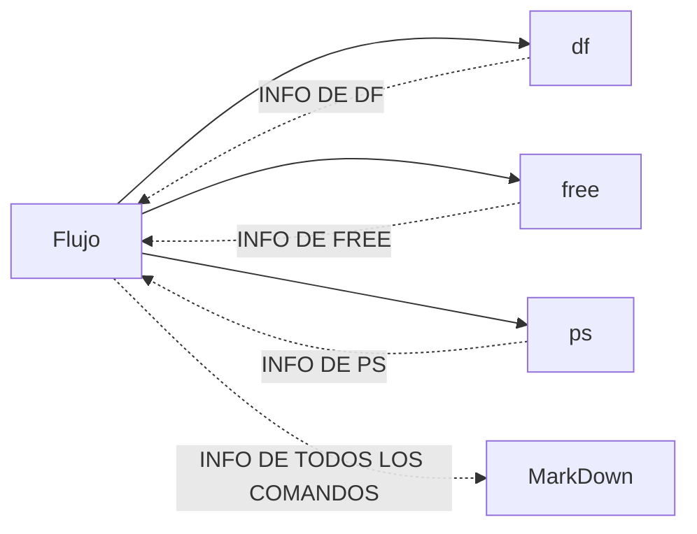
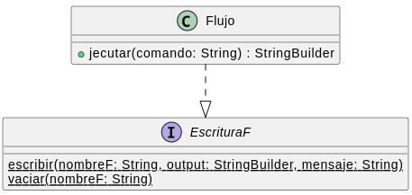
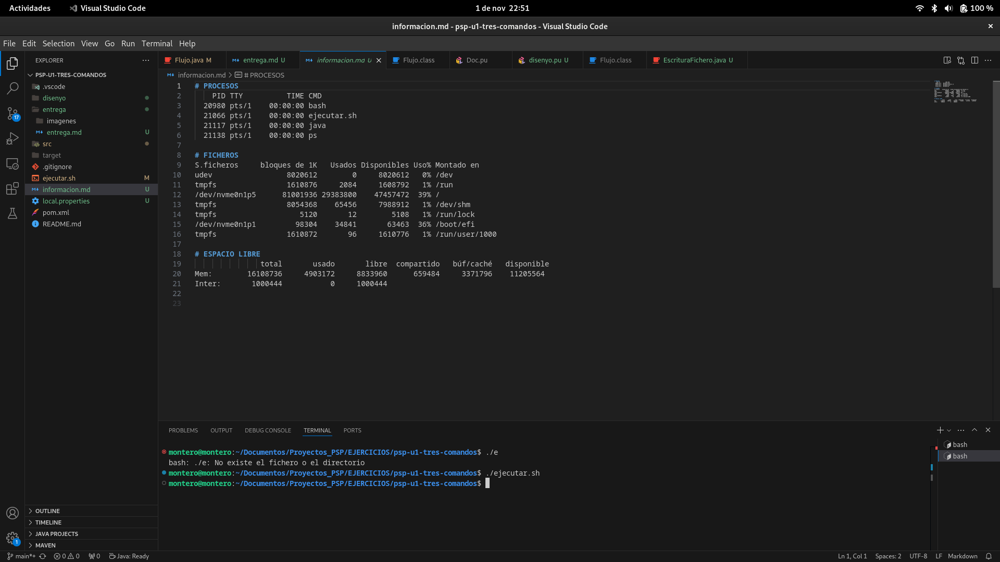

# PROGRAMA QUE MUESTRA LOS RECURSOS DEL SISTEMA
### ANÁLISIS


### DISEÑO
**CÓDIGO**
``` @startuml Doc

class Flujo {
    + ejecutar(comando: String) : StringBuilder
}

interface EscrituraF{
    {static} escribir(nombreF: String, output: StringBuilder, mensaje: String)
    {static} vaciar(nombreF: String)
}

Flujo ..|> EscrituraF
@enduml
```
**IMAGEN**


### CÓDIGO
**CLASE FLUJO**
```
package es.etg.psp.io;

import java.io.BufferedReader;
import java.io.IOException;
import java.io.InputStreamReader;

import es.etg.psp.io.LyEF.EscrituraFichero;

public class Flujo  implements EscrituraFichero{

	private static final String DEPRECATION = "deprecation";
    private static final String RUTA_FICHERO = "./../../../informacion.md";
	public static final String MSG_ERROR = "Se ha producido un error al ejecutar el comando";
	public static final String PROCESOS = "PROCESOS";
	public static final String FICHEROS = "FICHEROS";
	public static final String ESPACIO_LIBRE = "ESPACIO LIBRE";
	public static final String COMANDO_1 = "df"; 
    public static final String COMANDO_2 = "free";
	public static final String COMANDO_3 = "ps";

    public static void main(String[] args) throws Exception{
		EscrituraFichero.vaciar(RUTA_FICHERO);

		StringBuilder output1 = ejecutar(COMANDO_1);
		StringBuilder output2 = ejecutar(COMANDO_2);
		StringBuilder output3 = ejecutar(COMANDO_3);
		
		EscrituraFichero.escribir(RUTA_FICHERO, output3, PROCESOS);
		EscrituraFichero.escribir(RUTA_FICHERO, output1, FICHEROS);
		EscrituraFichero.escribir(RUTA_FICHERO, output2, ESPACIO_LIBRE);
	}		

	private static StringBuilder ejecutar(String comando) {
        try {
            @SuppressWarnings(DEPRECATION)
            Process process = Runtime.getRuntime().exec(comando);

            StringBuilder output = new StringBuilder();
            BufferedReader reader = new BufferedReader(new InputStreamReader(process.getInputStream()));
            String line;
            while ((line = reader.readLine()) != null) {
                output.append(line).append(SALTO_DE_LINEA);
            }

            int exitVal = process.waitFor();
            if (exitVal != 0) {
                System.out.println(MSG_ERROR);
                System.exit(1);
            }
            return output;

        } catch (IOException | InterruptedException e) {
            System.exit(34);
        }
        return null;
    }
}
```

**INTERFACE ESCRITURA FICHERO**
```
package es.etg.psp.io.LyEF;

import java.io.FileOutputStream;
import java.io.IOException;

public interface EscrituraFichero {
    public final String MSG_ERROR_ESCRITURA_FICHERO = "HA OCURRIDO UN ERROR AL ESCRIBIR EL FICHERO: ";
    public final String MSG_ERROR_VACIAR = "HA OCURRIDO UN ERROR AL VACIAR EL FICHERO";
    public final String SALTO_DE_LINEA = "\n";
	public final String ALMOHADILLA = "#";
	public final String ESPACIO_EN_BLANCO = " ";
    
    static void escribir(String nombreFichero, StringBuilder output, String mensaje) {
        try (FileOutputStream fos = new FileOutputStream(nombreFichero, true)) { // Al anyadir "true" no se sobreescribirá el contenido
            String datos = ALMOHADILLA + ESPACIO_EN_BLANCO + mensaje + SALTO_DE_LINEA + output.toString() + SALTO_DE_LINEA;
            byte[] byteArray = datos.getBytes();
            fos.write(byteArray);
        } catch (IOException e) {
            System.out.println(MSG_ERROR_ESCRITURA_FICHERO + e.getMessage());
        }
    }

    static void vaciar(String nombreFichero) {
        try (FileOutputStream fos = new FileOutputStream(nombreFichero)) { 

        } catch (IOException e) {
            System.out.println(MSG_ERROR_VACIAR + e.getMessage());
        }
    }
}
```
### PARTE EXTRA DEL EJERCICIO: REALIZADA
